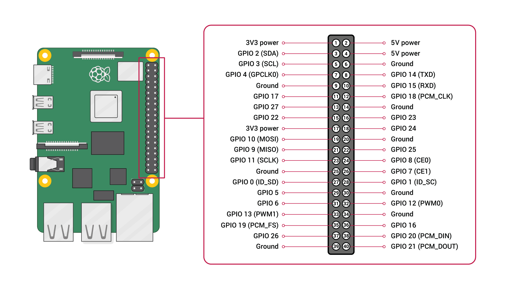

# iot-demo

> 演示如何用手机app通过树莓派点亮led

原理，手机app调用树莓派上的一个api，对gpio进行操作，从而点亮led。也可以增加继电器，从而点亮220v的电灯。

## 技术栈

硬件：树莓派4
后端：python，fastapi（web后端框架），RPi.GPIO（操作树莓派GPIO的python库），uvicorn（fastapi服务器）
前端/移动端：nodejs，react-native（移动端框架），expo（一个使用react-native生成原生app的工具）

> 实际上后端也可以使用node全家桶，比如express，egg等。也可以使用lavarel（PHP），也可以使用flask（python的web框架）。手机端也同样可以用AppCan、PhoneGap等。还可以直接编写原生应用，也并不复杂。总之，替换方案有很多。

## 使用方法

1、api目录部署在树莓派上。
2、light目录在PC端，替换App.js的第11行与13行中我的树莓派地址为你的树莓派地址。
3、生成app后，安装在android上，ios也是一样的，都可以通过命令生成。

生成方法，参考：https://docs.expo.io/distribution/building-standalone-apps/

4、树莓派的gpio17针脚，接led正极。led负极随便接到树莓派的GND针脚。
5、打开app，即可遥控。


## 具体步骤

1、树莓派上安装必要的工具
```
sudo apt install python3-pip RPi.GPIO
pip3 install fastapi
pip3 install uvicorn
```
2、在树莓派上面启动
```
cd api
uvicorn main:app --reload --host 0.0.0.0 --port 3000
```

3、通过url进行控制（使用gpio17）


```
http://树莓派的ip:3000/gpio/17/on
```

关
```
http://树莓派的ip:3000/gpio/17/off
```

也可以通过web工具进行调试
```
http://树莓派的ip:3000/docs#/
```

电脑端：

安装必要的工具
使用expo开发react native

```
npm install -g expo-cli
```

```
cd light
yarn add expo
expo build:android -t apk
```

手机端：
在电脑端，生成android，安装在手机上。

## 其他

1、树莓派4 gpio针脚图


2、demo

